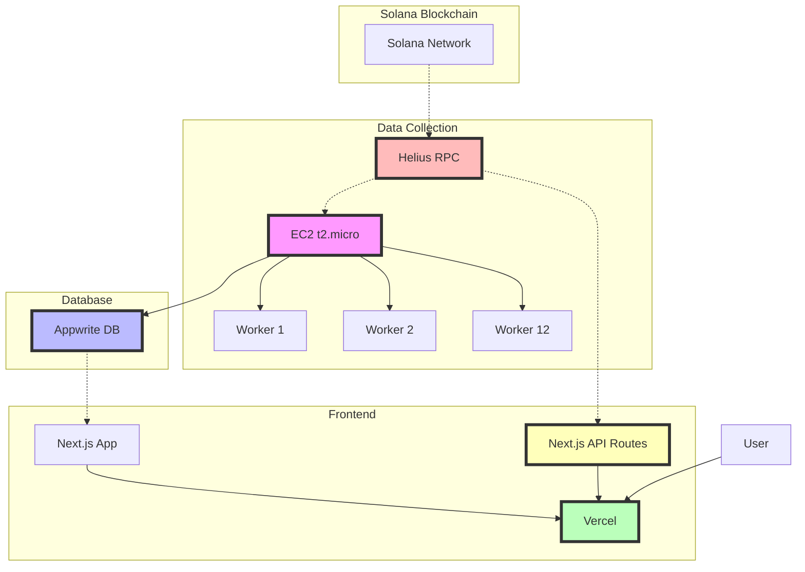
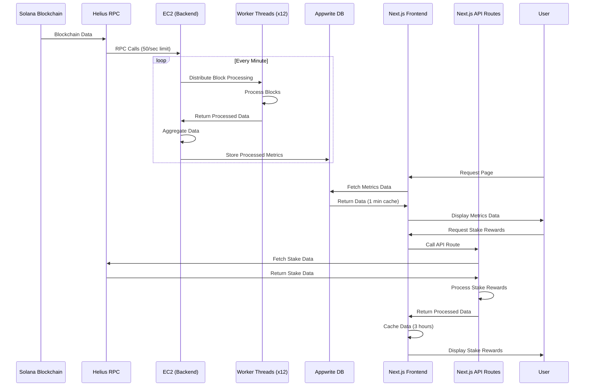
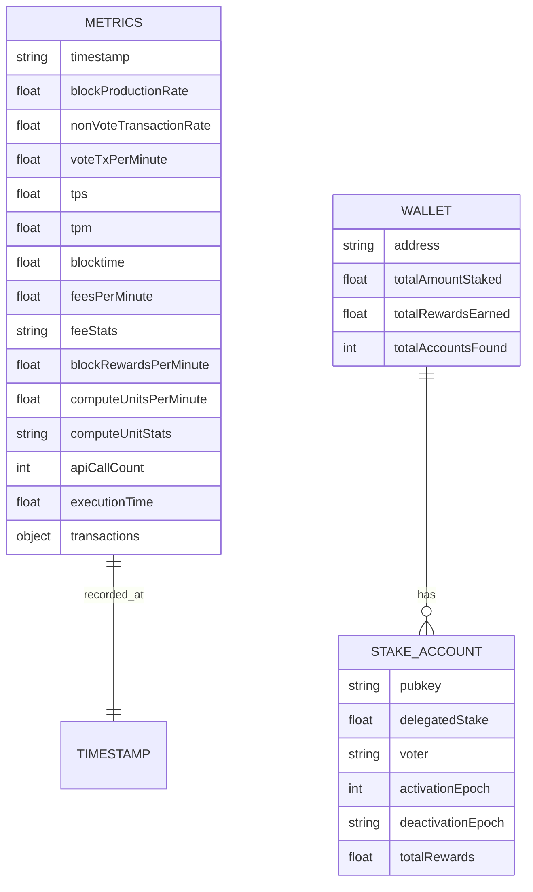

# Solana Metrics Dashboard

Solana Metrics Dashboard is a real-time analytics platform for the Solana blockchain. It provides comprehensive insights into network performance, transaction rates, and staking rewards. The dashboard offers both network-wide metrics and individual wallet staking information, making it a valuable tool for validators, developers, and Solana enthusiasts.

## Table of Contents

1. [Architecture](#architecture)
2. [Features](#features)
3. [Demo](#demo)
   - [System Architecture](#system-architecture)
   - [Data Flow](#data-flow)
   - [Database Schema](#database-schema)
4. [Installation](#installation)
   - [Prerequisites](#prerequisites)
   - [Setup Steps](#setup-steps)
5. [Deployment](#deployment)
6. [Metrics Documentation](#metrics-documentation)
7. [Authors](#authors)
8. [License](#license)

# Architecture

The project consists of two main components:

Backend Service (EC2):

Collects real-time data from the Solana blockchain via Helius RPC
Processes blocks using 12 worker threads for high performance
Stores aggregated metrics in Appwrite database

Frontend Application (Next.js):

Fetches and displays network metrics from Appwrite database
Retrieves individual wallet staking data directly from Solana RPC
Provides an intuitive user interface for data visualization

## Demo

### Brief System architecture



### Solana Metrics Data Flow



### Database Schema and Entity Relationship



## Features

- Real-time network metrics including TPS, TPM, block production rate, and more
- Individual wallet staking analysis
- High-performance backend with multi-threaded block processing
- Responsive frontend built with Next.js
- Efficient data storage and retrieval using Appwrite

# Solana Blockchain Metrics Documentation

## Overview

This document provides a detailed explanation of the metrics collected and calculated by the Solana blockchain metrics script, as well as how they are visualized in the frontend dashboard. The script monitors various aspects of the Solana network, including transaction rates, block production, fees, and computational resources used. These metrics are crucial for understanding the network's performance, usage patterns, and economic aspects.

## Frontend Dashboard Layout

The frontend dashboard is organized into several sections:

1. Summary
2. Transactions
3. Compute Units
4. Blocks
5. Fees
6. Overview

Each section provides different visualizations and statistics to give a comprehensive view of the Solana network's performance.

## Metrics Calculation Methodology, Visualization, and Usage

### 1. Transaction Metrics

#### a. Transactions Per Second (TPS)

**Calculation:**

```
tps = totalTransactions / timeElapsedInSeconds
```

**Visualization:**

- Displayed as a large number in the summary section
- Line graph showing TPS over time (last 24 hours)

**Usage/Usefulness:**

- Key performance indicator of blockchain throughput
- Helps in comparing Solana's performance to other blockchains
- Useful for developers to understand current network capacity

#### b. Transactions Per Minute (TPM)

**Calculation:**

```
tpm = totalTransactions / timeElapsedInMinutes
```

**Visualization:**

- Displayed as a large number in the summary section
- Line graph showing TPM over time (last 24 hours)

**Usage/Usefulness:**

- Provides a broader view of transaction volume over time
- Useful for applications that don't require second-by-second precision

#### c. Vote vs Non-Vote Transaction Rate

**Visualization:**

- Stacked area chart comparing vote and non-vote transaction rates per minute over the last 24 hours

**Usage/Usefulness:**

- Helps distinguish between consensus-related activity and user/application transactions
- Provides insights into the ratio of network overhead to useful work

#### d. Transaction Table

**Visualization:**

- Table showing timestamp, TPS, TPM, Block Production Rate, and Blocktime for the last 10 data points

**Usage/Usefulness:**

- Allows for precise examination of recent network activity
- Useful for identifying short-term trends or anomalies

### 2. Block Production Metrics

#### a. Block Production Rate

**Calculation:**

```
blockProductionRate = (endSlot - startSlot) / timeElapsedInMinutes
```

**Visualization:**

- Displayed as a large number in the summary section
- Line graph showing block production rate over time

**Usage/Usefulness:**

- Indicates the network's current pace of block production
- Helps in understanding network congestion and overall health
- Useful for validators to gauge their performance relative to the network

#### b. Blocktime

**Calculation:**

```
blocktime = timeElapsedInSeconds / (endSlot - startSlot)
```

**Visualization:**

- Displayed as a large number in the summary section
- Line graph showing blocktime over time

**Usage/Usefulness:**

- Indicates how quickly the network is processing and finalizing transactions
- Important for applications requiring quick transaction confirmations

### 3. Compute Unit Metrics

**Calculation:**

- Uses a running statistics algorithm to calculate min, max, mean, median, and variance of compute units used per transaction

**Visualization:**

- Bar chart showing the distribution of compute units per transaction
- Statistics display (min, max, mean, median, variance)
- Line graph showing compute units used over time (last 24 hours)

**Usage/Usefulness:**

- Indicates the computational complexity of transactions on the network
- Helps in understanding resource usage and potential bottlenecks
- Useful for optimizing smart contracts and transactions

### 4. Fee Metrics

**Calculation:**

- Uses a running statistics algorithm to calculate min, max, mean, median, and variance of transaction fees

**Visualization:**

- Bar chart showing the distribution of fees per transaction
- Statistics display (min, max, mean, median, variance)
- Line graph showing fees collected over time (last 24 hours)

**Usage/Usefulness:**

- Provides insights into the current cost of using the network
- Helps users and developers estimate transaction costs
- Useful for economic analysis of the network

### 5. Overview Section

**Visualization:**

- Summary of all metrics in a concise format

**Usage/Usefulness:**

- Provides a quick glance at all key metrics
- Useful for getting a holistic view of the network's current state

## Data Refresh and Historical View

- The dashboard refreshes data every minute
- Most visualizations provide a 24-hour historical view, allowing for the identification of trends and patterns

## Conclusion

This comprehensive dashboard provides real-time and historical insights into the Solana blockchain's performance, economic aspects, and resource utilization. By combining various visualizations and statistics, it offers valuable information for different stakeholders:

1. **Developers:** Can gauge network capacity, transaction costs, and computational resource usage to optimize their applications.
2. **Validators:** Can monitor block production rates and overall network health.
3. **Investors:** Can track network usage and economic metrics to inform investment decisions.
4. **Researchers:** Can analyze trends and patterns in various network metrics.

By monitoring these metrics over time, users can gain deep insights into network trends, identify potential issues, and make informed decisions about building, deploying, and using the Solana blockchain.

## Installation

## Prerequisites

Node.js (v14 or later)
npm or yarn
AWS account (for EC2 deployment)
Appwrite account
Helius RPC API key

### 1. Clone the repository:

```
git clone https://github.com/yourusername/solana-metrics-dashboard.git

cd solana-metrics-dashboard
```

### 2. Set up environment variables:

Create a .env file and add the following:

**_For backend_**

```
cd solana-metrics-backend/

SOLANA_RPC_URL=https://api.mainnet-beta.solana.com
APPWRITE_PROJECT_ID=your_project_id
APPWRITE_API_KEY=your_api_key
APPWRITE_DATABASE_ID=your_database_id
APPWRITE_COLLECTION_ID=your_collection_id

```

**_For frontend_**

```
cd client/

SOLANA_RPC_URL=https://api.mainnet-beta.solana.com
APPWRITE_PROJECT_ID=your_project_id

```

### 3. Install dependencies:

**_For frontend_**

```
cd client

npm install

npm run build

```

**_For backend_**

```
cd solana-metrics-backend/

npm install

npm run build

```

## Deployment

**_Backend_**

```
npm start
```

**_Frontend_**

```
npm run dev ( for local dev)

npm start
```

## Authors

- [@Dksie09](https://github.com/Dksie09)

## License

This project is open source and built under Superteam Talent Olympics and is licensed under MIT license.

See the [LICENSE](./LICENSE) file in the root directory of this project for the full license text.
